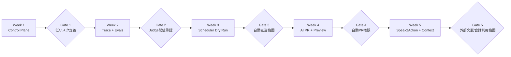
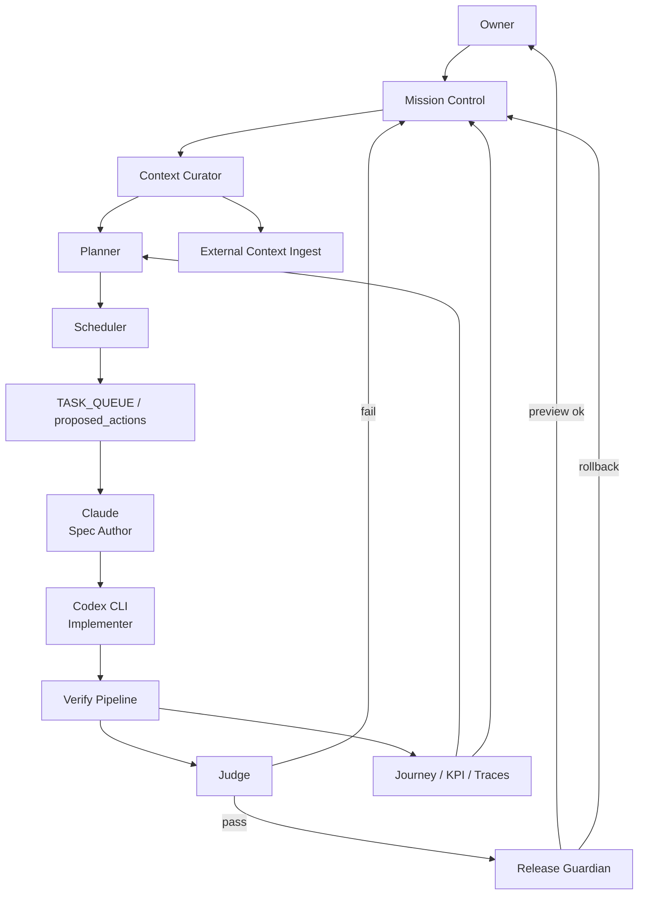

# School リポジトリの知見を自分のリポジトリへ移植するAI主導運用設計レポート

## エグゼクティブサマリー

GitHub connector で確認した範囲では、School はすでに「AI が実装をかなり先まで進め、人間は採否と高リスク判断だけを握る」ための下地を持っています。構造は大きく三層で、学習プラン runtime、Owner ローカル限定の `lesson-factory`、そして SwarmOps と呼べる開発制御ループです。SwarmOps 側では `new-task.sh` でタスク専用ブランチと `vibe/spec` 雛形を起票し、Claude が仕様を詰め、Codex CLI が実装と E2E と manifest 更新を担当し、`verify.sh` が DB reset → Playwright → local verify → journey-map 再生成までを一気通貫で回します。しかも `generate-task-queue.mjs` は改善候補を自動生成する一方、`TASK_QUEUE.md` 本体は自動更新せず、Owner が採否を決める設計です。つまり、**自動化は深いが、不可逆判断は人間に残す**という境界がかなり明確です。fileciteturn64file0L1-L1 fileciteturn65file0L1-L1 fileciteturn73file0L1-L1 fileciteturn74file0L1-L1 fileciteturn75file0L1-L1 fileciteturn66file0L1-L1

一方で、あなたが目指しているのは「AI が評価・実装・スケジューリング判断まで主導し、あなたは critical decision だけ介入する」状態です。その観点では、School からそのまま持ってくるべきなのは教育プロダクトの UI ではなく、**運用 OS としての閉ループ**です。そして、それをあなたのアップロード文書にある思想、つまり **Goal2Action** のゴールツリー起点、**Speak2Action** の会話→ゴール接続アクション変換、**Context2Action** のゴール単位コンテキスト集約に重ねるのが最短です。アップロード文書では、ゴールツリーが人間・部下・AI・エージェントの行動を大目標に接続し、さらに期日・担当・AI 委譲までゴール起点で立ち上がるべきこと、会話が議事録どまりではなくゴールに紐づく次のアクションへ変わるべきこと、散在情報をゴール基準で束ねるべきことが繰り返し述べられています。したがって、あなたの repo で最初に作るべきなのは、**Goal / Context / Action / Schedule / Evaluation / Approval** を一つの制御面に載せる「Decision Ledger」です。fileciteturn0file0L398-L419 fileciteturn0file0L585-L618 fileciteturn0file0L167-L200 fileciteturn0file0L1022-L1089

結論として、移植順序は次の五段階が最適です。**第一に** School の SwarmOps をあなたの repo に薄く移植して、AI が「タスク化→実装→検証→PR 生成」まで責任を持てるようにすること。**第二に** goal tree を first-class object にした Decision Ledger を追加すること。**第三に** telemetry、trace、judge-eval、task proposal をつないで「評価結果が次の作業を生む」閉ループを作ること。**第四に** 期日・担当・AI 委譲を扱う Scheduler/Dispatcher を入れること。**第五に** 会話と外部文脈を goal 単位へ取り込む Speak2Action / Context2Action 系の ingest を入れることです。なお、ツール面では、entity["company","OpenAI","ai company"] の Codex/Codex CLI は並列タスク実行と CLI 自動化に向いており、entity["company","Anthropic","ai company"] の Claude Code は terminal-native な agentic coding とレビューに向いています。したがって、**Claude = 仕様・レビュー、Codex = 実装・検証**という School の分業は、公式な製品特性とも整合しています。citeturn0search0turn0search1turn0search3turn0search4turn2search0turn2search6

## リポジトリ現状分析

School の現状を一言で言うと、**「AI 主導開発の control plane はかなり育っているが、スケジューリングと意思決定の first-class 化はまだ弱い」**です。monorepo は `apps/*`、`lesson-factory`、`packages/*` の pnpm/Turbo 構成で、`apps/web` は Next.js 16 + React 19 + Tailwind 4 + Supabase を中心とする runtime、`apps/admin` は管理画面、`packages/ui` は共有 UI、`lesson-factory` は Owner ローカル限定の教材生成工場として分離されています。fileciteturn50file0L1-L1 fileciteturn51file0L1-L1 fileciteturn52file0L1-L1 fileciteturn53file0L1-L1 fileciteturn54file0L1-L1 fileciteturn56file0L1-L1

runtime 側の設計は想像以上に成熟しています。`/api/plans/compile` は zod による body 検証と AI-heavy endpoint 用レート制限をかけたうえで、認証ユーザーには AI プラン生成を試し、失敗時には seed 付き決定論的キャッシュ経路へフォールバックし、結果を `compiled_plans` に永続化して telemetry を送ります。`ai-atom-compiler` は ZAI/GLM-5 を使った atom 選定を行い、ベクトル検索が使えれば hybrid retrieval、失敗時は deterministic compiler に落ちる設計です。これは「AI に寄せるが、AI が壊れても壊れない」という donor pattern として非常に強いです。fileciteturn41file0L1-L1 fileciteturn72file0L1-L1 fileciteturn40file0L1-L1 fileciteturn70file0L1-L1 fileciteturn37file0L1-L1 fileciteturn36file0L1-L1

ただし、この planner はまだ「スケジュール実行系」ではありません。goal intake wizard では期限・利用ツール・経験などを集め、AI compiler も `deadline` や `aiTools` を learner context として受け取っていますが、少なくとも確認できた範囲では、それが **スケジューラ専用キュー**、**担当割当ルール**、**自動再計画ループ**のような first-class runtime にまでは昇格していません。言い換えると、School はすでに「AI による plan 生成」はあるが、「AI による plan 運行」はまだ弱い、という状態です。あなたの repo ではここを埋めるべきです。fileciteturn47file0L1-L1 fileciteturn70file0L1-L1

次の表は、GitHub connector から見えた current state を、移植価値の観点で要約したものです。fileciteturn50file0L1-L1 fileciteturn51file0L1-L1 fileciteturn57file0L1-L1 fileciteturn61file0L1-L1 fileciteturn62file0L1-L1

| 項目 | 現状 | あなたの repo への含意 |
|---|---|---|
| アーキテクチャ | `apps/web`、`apps/admin`、`lesson-factory`、`packages/ui` に責務分離された monorepo。`lesson-factory` は Owner ローカル限定で、runtime と制作ループを切り分けている。fileciteturn50file0L1-L1 fileciteturn52file0L1-L1 fileciteturn53file0L1-L1 fileciteturn76file0L1-L1 | あなたの repo でも、**runtime** と **AI workbench** と **ops control plane** を分けるべきです。 |
| 計画生成 | AI compiler + deterministic fallback + seed cache + compiled plan persistence。AI 不調でも破綻しない。fileciteturn41file0L1-L1 fileciteturn40file0L1-L1 fileciteturn70file0L1-L1 | 生成 AI を多用しても、**cache / fallback / replayability** を必須にすべきです。 |
| 制作パイプライン | intake → draft → critique → media → eval → publish の 6 段。`stable` 自動昇格は禁止。外部 context 取得も draft 前段に挿せる。fileciteturn76file0L1-L1 | そのまま「意思決定→提案→実装→評価→昇格」に置き換え可能です。特に **自動昇格禁止** は維持推奨です。 |
| テスト | root test は lesson-factory / web node tests / web vitest / admin tests を束ね、Playwright は real local Supabase + mocked AI の二層。fileciteturn50file0L1-L1 fileciteturn42file0L1-L1 fileciteturn43file0L1-L1 | AI repo でも **mocked AI と real DB を分ける**のが重要です。 |
| CI/CD | 標準運用は local verify。GitHub Actions の `CI` / `Release` は `workflow_dispatch` のみで、自動トリガーは外している。release workflow には preview deploy、smoke、rollback、DB restore まである。fileciteturn58file0L1-L1 fileciteturn61file0L1-L1 fileciteturn62file0L1-L1 fileciteturn63file0L1-L1 | あなたの repo はこれを **hybrid 化**すべきです。PR verify は自動、本番 promote は手動がよいです。 |
| SwarmOps | Claude=vibe/spec/review、Codex CLI=implement/E2E/green。`verify.sh` は criteria violations 集計と journey-map 生成まで持つ。fileciteturn64file0L1-L1 fileciteturn65file0L1-L1 fileciteturn73file0L1-L1 | これはそのまま移植すべき本体です。 |
| backlog | `TQ-118`〜`TQ-123` が open で、criteria-violations、PostHog イベント、TASK_QUEUE 自動生成、live AI E2E 統合など、閉ループ強化が未完。`TQ-124` は完了。fileciteturn66file0L1-L1 | donor repo 自体が「評価→次タスク」の自動化を拡張中なので、あなたの repo では最初からそこを first-class にすべきです。 |
| README / docs のズレ | README の tree は `packages/ui` を「今後」と書いているが実際には package が存在し、README は web port 3000 と書く一方 Playwright/実運用は 3200 前提。さらに README は Phase 8 で old track-registry 削除と書くが、CI/CD ドキュメントには 4 tracks を `/api/smoke` で確認すると残っている。fileciteturn57file0L1-L1 fileciteturn53file0L1-L1 fileciteturn42file0L1-L1 fileciteturn63file0L1-L1 | 自動化を強くするほど docs drift は危険です。**docs も eval 対象**に含めるべきです。 |

現在の repo health については、2026-04-11 の完了レポートで多くの P0/P1 項目が片付き、プラン決定論、型安全性、デッドコード削除、E2E 基盤改善が進んだ一方で、`as never` クラスタや docs cleanup、cache 活性化の残件はまだ残っています。したがって、School は「アイデアを学ぶのに十分成熟している」が、「そのまま複写して完全自律にする段階ではない」と評価するのが妥当です。fileciteturn35file0L1-L1

## 優先順位付き導入方針

School の repo 側ループと、アップロード文書側の Goal2Action / Speak2Action / Context2Action を重ねたとき、あなたの repo で最優先にやるべき対象は次の通りです。重要なのは、**「AI が考える」前に「AI がどの状態を見て、どの判断をどこに残すか」を固定すること**です。School はその設計を `TASK_QUEUE.md`、`vibe/spec`、`verify.sh`、`journey-map` で実現していますし、アップロード文書は goal tree を起点に期限・担当・AI 委譲・会話・散在コンテキストを接続すべきだと示しています。両者を繋ぐ最短手は、decision ledger を中心に据えることです。fileciteturn66file0L1-L1 fileciteturn73file0L1-L1 fileciteturn75file0L1-L1 fileciteturn0file0L398-L419 fileciteturn0file0L585-L618 fileciteturn0file0L1022-L1089

| 優先度 | 機能 / AI自動化対象 | 何をするか | 理由 | 工数 | リスク |
|---|---|---|---|---|---|
| 最優先 | Decision Ledger | `goals`, `goal_nodes`, `goal_contexts`, `proposed_actions`, `schedule_slots`, `agent_runs`, `evaluation_runs`, `approval_gates` を first-class にする | ゴール、文脈、提案、評価、承認が別々だと AI は安定して判断できません。 | 中 | 中 |
| 最優先 | SwarmOps-lite 移植 | `new-task`、`spec`、`codex-handoff`、`verify`、`task proposal` をあなたの repo に持ち込む | いま一番即効性が高く、School で実証されている部分だからです。 | 中 | 低 |
| 最優先 | 評価閉ループ | trace、judge、journey KPI、task proposal 生成をつなぐ | AI が次に何を直すかを決める根拠が必要です。 | 中 | 中 |
| 高 | Scheduler / Dispatcher | 期日、担当、AI委譲を recommendation と execution に分けて扱う | アップロード文書の中核価値であり、School の弱い部分でもあるためです。 | 高 | 中〜高 |
| 高 | Context2Action 層 | goal ごとに必要文脈を bundle 化し、agent が常にそこを見るようにする | 散在文脈のままでは AI 判断精度がぶれます。 | 中 | 中 |
| 高 | Speak2Action ingest | meeting note / transcript / huddle から goal-linked action proposal を作る | 会話起点の前進を repo-level task loop に接続できるためです。 | 高 | 高 |
| 中 | 外部リサーチ ingest | X / Web / RSS / GitHub releases などを context bundle に追加 | School の `lesson:research` を一般化して freshness を上げられます。 | 中〜高 | 中 |
| 中 | 自動 PR / Preview / Rollback | AI が branch/PR/preview まで作り、judge と smoke が通れば低リスク変更だけ merge-readyにする | School release workflow の成熟度を repo 開発へ持ち込めます。 | 中 | 高 |
| 継続 | docs drift 検知 | README / runbook / smoke docs / manifest の相互整合テスト | School で実際に drift が見えているため、早期に入れる価値があります。 | 低 | 低 |

この優先順位で特に重要なのは、**スケジューリングを最初から自動 execute にしないこと**です。初期は「AI が schedule を提案し、人間が approve する」片方向で十分です。School でも `task-proposals` は自動生成されますが、`TASK_QUEUE.md` は Owner が採否を決めます。あなたの repo でも、最初はこの boundary を守るべきです。fileciteturn75file0L1-L1 fileciteturn66file0L1-L1

## スプリント計画

私は 5 週間構成を推奨します。3 週間でも PoC は可能ですが、あなたが求めるのは「AI が評価・実装・スケジューリング判断まで回す」状態なので、**最低でも control plane・eval・scheduler の 3 本柱**が必要です。School の既存ループをそのまま薄く移植し、そこから goal/context/schedule を載せる順序が最も安全です。fileciteturn64file0L1-L1 fileciteturn73file0L1-L1 fileciteturn76file0L1-L1

| 週 | 主要 deliverables | 受け入れ条件 | 測定指標 | あなたの判断が必要な点 |
|---|---|---|---|---|
| Week 1 | SwarmOps-lite、Decision Ledger の最小スキーマ、`TASK_QUEUE.md`、`CURRENT_MISSION.md`、PR template | `ai:new-task` 相当で branch + spec + verify が動き、1 件の低リスク AI PR が green になる | AI PR 生成数、verify green 率、レビュー修正行数 | 低リスク変更の定義 |
| Week 2 | trace / eval / journey KPI / task proposal generator、judge rubric v1 | 30 件以上の gold ケースで nightly eval が回り、score と failure reason が保存される | judge-human 合意率、task proposal 採用率、p95 推論時間 | rubric 閾値、judge モデル |
| Week 3 | Scheduler / Dispatcher の dry-run 運用、goal-based schedule recommendation | action に due date・assignee・AI/human delegate が付与されるが、まだ自動実行しない | schedule 採用率、期限逸脱検出率、manual override 率 | auto-assign の許容範囲 |
| Week 4 | Codex/Claude 実装ループの本格連携、preview deploy、自動 rollback 前提の release gate | 低リスク 3 タスク以上を AI が spec → code → tests → PR まで完走 | PR green 率、rollback 率、平均 lead time | preview 自動生成の解禁 |
| Week 5 | Speak2Action / Context2Action ingest、external context adapters、運用 runbook | meeting note から goal-linked action が出て、context bundle に source と freshness が残る | action 採用率、context 充足率、手動修正率、PII redaction 成功率 | transcript 系の privacy policy |

この timeline の意図は、**AI の権限を毎週少しずつ広げる**ことです。いきなり full auto にせず、`提案` → `PR` → `preview` → `本番候補` の順で権限を拡張すると、誤判断のコストを低く抑えられます。School が publish、stable 昇格、production deploy を手動に残しているのも、同じ理由です。fileciteturn76file0L1-L1 fileciteturn63file0L1-L1 fileciteturn62file0L1-L1

## マルチエージェント設計

School の既存分業は明快です。Claude は `vibe/spec/review`、Codex CLI は `implement + E2E + green gate` です。これをそのまま核にして、外側に Planner、Context Curator、Scheduler、Judge、Release Guardian を足すのが最も自然です。また公式ドキュメント上も、Codex は CLI / app の両面で複数タスクの並列実行や coding agent 運用を前提にしており、Claude Code も terminal-native に code edit、command 実行、web 参照、MCP 利用、CI 連携を想定しています。したがって、School の役割分担は偶然ではなく、公式の得意領域と一致しています。fileciteturn64file0L1-L1 fileciteturn65file0L1-L1 citeturn0search0turn0search1turn0search3turn2search0turn2search6

| Agent | 主責務 | 入力 | 出力 | 主な実行主体 | 権限 |
|---|---|---|---|---|---|
| Mission Control | 目標の分解、現在 mission の固定、agent への配車 | `CURRENT_MISSION.md`, goal tree, KPI, backlog | `TASK_QUEUE.md`, priority changes, handoff packets | Claude | 提案のみ |
| Context Curator | その goal に必要な文脈を集め bundle 化 | docs, issues, transcripts, telemetry, external sources | `goal_context_bundle.json` | Claude か軽量 planner model | 提案のみ |
| Planner | 次に進める action 候補を出す | goal tree, context bundle, prior evals | `proposed_actions` rows | GPT-5-mini / Gemini Flash 級 | 提案のみ |
| Scheduler | due date、assignee、人/AI 委譲を決める | `proposed_actions`, calendars, workload, risk labels | `schedule_slots`, dispatch plan | ルール + LLM | 初期は提案のみ |
| Spec Author | vibe を仕様へ落とす | selected action, context bundle, templates | `spec.md`, AC, test nodes | Claude Code | 編集可 |
| Implementer | コード変更、テスト追加、PR 化 | `spec.md`, manifest, repo | diff, tests, PR branch | Codex CLI | 低リスク変更のみ |
| Judge | 実装品質・要件適合・リスクを判定 | diff, traces, test results, eval rubrics | score, fail reasons, approve/block | OpenAI eval または独立 judge model | merge 不可、判定のみ |
| QA Verifier | verify 実行、journey-map / criteria violations 集計 | built app, db reset, playwright | green/red, warn map, artifacts | scripts + CI | 実行可 |
| Release Guardian | preview deploy、smoke、rollback、prod promote 前の最終 gate | PR SHA, migration diff, smoke results | deployable / block / rollback | CI + human gate | 本番は人承認必須 |
| Budget & Policy Watcher | token cost、PII、provider fallback、権限逸脱を監視 | trace, billing, run metadata | budget alerts, policy blocks | ルール engine | block 可 |

このチームで大事なのは、**writer と judge を分けること**、そして **scheduler と executor を分けること**です。実装した agent が自分で judge を兼ねると評価が甘くなりやすく、scheduler がそのまま external action を叩くと誤実行のコストが高くなります。よって、Week 3 までは scheduler は必ず dry-run、Week 4 以降でも executor は PR 生成までにとどめ、本番 promote は Release Guardian + あなたの承認に残すべきです。これは School が `task-proposals` の採否、`stable` 昇格、production deploy を人間に残しているのと同じ設計思想です。fileciteturn75file0L1-L1 fileciteturn76file0L1-L1 fileciteturn62file0L1-L1

この図は、School の既存 Claude/Codex 分業に、Context Curator、Scheduler、Judge、Release Guardian を外付けしたものです。中心に置くべき SoT は、コードではなく **Decision Ledger** です。コードはその結果として変わる、という順序にすると、AI が「なぜその変更をしたか」を後から説明できます。fileciteturn65file0L1-L1 fileciteturn73file0L1-L1 fileciteturn0file0L1022-L1089

## CodexやClaudeに渡せる実装タスク分解

以下は、あなたがそのまま Codex / Claude タスクに落とせる粒度まで分解したものです。School の `TQ-XXX` 形式を踏襲しつつ、教育ドメインではなく repo 運用ドメインへ一般化しています。fileciteturn45file0L1-L1 fileciteturn74file0L1-L1

| ID | タイトル | 説明 | 入力 | 期待出力 | テストケース | 見積 |
|---|---|---|---|---|---|---|
| AI-001 | Decision Ledger スキーマ追加 | goals / contexts / actions / approvals / eval_runs / agent_runs / schedule_slots を追加 | 現行 DB schema、goal/action 要件 | migration SQL、型生成、repository 層 | insert/update/select、RLS、rollback | 0.5〜1日 |
| AI-002 | SwarmOps-lite 雛形導入 | `docs/swarmops`, `TASK_QUEUE.md`, `CURRENT_MISSION.md`, `new-task`, `verify` を導入 | repo root、CI 方針 | scripts、templates、docs | new task 作成、verify 実行、1タスク完走 | 1日 |
| AI-003 | Goal Context Bundle 実装 | goal 起点で doc / issue / meeting note / telemetry を束ねる | docs source、issue source、trace source | `goal_context_bundle` builder | context completeness、missing source fallback | 1〜1.5日 |
| AI-004 | Scheduler Dry Run | due date、assignee、AI/human delegate 推定。実行はしない | proposed_actions、workload、policy | ranked schedule proposal、confidence | schedule determinism、policy block | 1〜2日 |
| AI-005 | Task Proposal Generator | eval / journey / telemetry から改善候補を自動生成 | traces、eval scores、journey metrics | `task-proposals.md`, ranked candidate list | stale input 除外、top N 選定 | 1日 |
| AI-006 | Judge Evals 基盤 | rubric、dataset、scoring API、nightly run | sample tasks、gold answers | eval results, thresholds, dashboards | judge-human agreement、schema validation | 1〜2日 |
| AI-007 | AI PR Worker | spec を読んで branch 作成、実装、テスト、PR 作成まで行う | `spec.md`, repo, branch rules | diff、PR、run report | low-risk docs/task で end-to-end 成功 | 1〜2日 |
| AI-008 | Preview Release Gate | preview deploy、smoke、failure rollback を整備 | deployed preview env、smoke endpoints | deploy verdict、rollback report | smoke fail 時の block/rollback | 0.5〜1日 |
| AI-009 | Speak2Action Ingest | transcript / note から goal-linked action draft を生成 | meeting note、goal tree | action proposals、source refs、PII-redacted summary | hallucination source check、PII redaction test | 2日 |
| AI-010 | Docs Drift Check | README / runbook / smoke docs / config の整合検査 | docs, config, scripts | docs check report | port mismatch、package drift、removed feature reference | 0.5日 |

この 10 タスクのうち、**Week 1 で最低限必要なのは AI-001, AI-002, AI-005** です。**Week 2 で AI-006**、**Week 3 で AI-004**、**Week 4 で AI-007, AI-008**、**Week 5 で AI-003, AI-009, AI-010**が自然です。School の donor value は AI-002 / AI-005 / AI-007 / AI-008 に最も強く現れています。fileciteturn65file0L1-L1 fileciteturn73file0L1-L1 fileciteturn75file0L1-L1 fileciteturn62file0L1-L1

## CI/CDと自動評価と監視

School は安全側に寄せて、標準運用を local verify + 手動 migration + 必要時のみ手動 deploy に置いています。GitHub Actions の `CI` と `Release` は `workflow_dispatch` のみで、release workflow 自体はかなりしっかりしており、staging preview、smoke test、production backup、rollback alias、DB restore まで含みます。GitHub 公式ドキュメント上も manual run は `workflow_dispatch` を使うのが正道です。したがって、あなたの repo では **School と同じ safety boundary を保ちつつ、PR verify と nightly eval だけ自動化する hybrid CI** が最適です。fileciteturn61file0L1-L1 fileciteturn62file0L1-L1 fileciteturn63file0L1-L1 citeturn0search2turn0search7

| 選択肢 | 内容 | 長所 | 短所 | 推奨度 |
|---|---|---|---|---|
| Local-only | School そのまま。verify はローカル、CI/Release は手動起動のみ | 安全、コスト低、制御しやすい | AI ループが遅い。夜間 eval が回りにくい | 初期 PoC だけ |
| Hybrid | PR で unit / targeted e2e / static checks / eval-lite 自動、release は手動 promote | 安全と速度のバランスが良い | workflow 設計は少し複雑 | **最推奨** |
| Full auto | PR から release promote まで自動 | lead time 最短 | 誤 deploy / 誤 migration のコストが高い | 6週間以内は非推奨 |

自動評価パイプラインは、School の journey-based verify をベースに、**四層**にすると実用的です。**第一層**は lint / type / unit / Vitest / targeted Playwright。**第二層**は dataset ベースの offline eval。**第三層**は trace と live observation の online eval。**第四層**は task proposal 生成です。OpenAI の Agent Evals は再現可能な評価と trace grading を前提にしており、Langfuse は trace / observation / cost / LLM-as-a-Judge に強く、OpenTelemetry の GenAI semantic convention は token usage、duration、agent/tool span を共通表現で扱えます。つまり、**verify は pass/fail、eval は quality、trace は reason、task-proposals は next action** という役割分担にすると強いです。fileciteturn73file0L1-L1 fileciteturn75file0L1-L1 citeturn7search0turn7search1turn5search0turn5search1turn5search2turn5search5turn5search8turn4search3turn4search5turn4search6

次の監視指標を最初から入れてください。これは単なる技術監視ではなく、**AI の意思決定品質を監視するための指標**です。School でも `criteria-violations`、journey-map、PostHog event 欠落補完、Sentry requestId を使って次タスクを選ぶ方向へ進んでいます。fileciteturn66file0L1-L1 fileciteturn75file0L1-L1

| 指標群 | 最低限見る指標 |
|---|---|
| 実装品質 | verify green 率、judge score、rollback 率、reopen 率 |
| スケジュール品質 | schedule 採用率、manual override 率、期限逸脱率、replan 回数 |
| コンテキスト品質 | source coverage、stale context 率、missing reference 率 |
| AI 運用品質 | token cost / accepted task、fallback 率、timeout 率、provider 切替率 |
| UX / 業務品質 | blocked event、journey friction、task proposal 採用率、meeting-to-action latency |

failure handling は、School release workflow の思想をそのまま repo 開発へ拡張すると良いです。preview smoke 失敗で block、production smoke 失敗で rollback、judge fail で draft 戻し、provider 429/5xx で deterministic fallback、budget 超過で hard block、PII 検知で manual review 送り、というマトリクスを先に決めておくべきです。fileciteturn62file0L1-L1 fileciteturn70file0L1-L1 fileciteturn65file0L1-L1

## セキュリティとモデル選定と移行リスク

### セキュリティとプライバシー

School の現状から直接学ぶべき security boundary は四つあります。ひとつ目は、service role を server-only に閉じること。ふたつ目は、admin 権限をメール allowlist や metadata で明示的に絞ること。みっつ目は、AI endpoint に zod validation と rate limit を入れること。よっつ目は、publish / deploy / stable 昇格のような不可逆操作を手動 gate に残すことです。これは repo 内の実装で確認できます。さらに provider 側のデータ利用ポリシーでは、OpenAI の business/API データはデフォルトで学習に使われず、Anthropic も commercial/API では学習に使わず、適切な API key では zero data retention が選べます。したがって、**機密 repo では business/commercial 契約 + server-side mediation + pseudonymous IDs + transcript redaction** が基本線です。fileciteturn49file0L1-L1 fileciteturn48file0L1-L1 fileciteturn72file0L1-L1 fileciteturn76file0L1-L1 fileciteturn63file0L1-L1 citeturn8search5turn8search7turn8search0turn8search1

加えて、local development と preview security も最初から固めるべきです。Supabase は local stack を CI でもローカルでも動かせますが、untrusted network では 127.0.0.1 bind を推奨しています。Vercel は preview / deployment URL を保護でき、production protection はプラン条件があります。よって、meeting ingest や external context のような未整備機能は、**preview protected 環境でのみ評価**し、本番は別 gate にすべきです。citeturn6search0turn6search1turn6search2turn6search4turn6search7

| 論点 | 推奨方針 |
|---|---|
| PII | email / raw transcript / 顧客名は provider に直接送らない。goal/context bundle には pseudonymous ID と source ref のみ保存 |
| 権限 | AI worker は branch 作成・PR 作成までは可。`main` 直 push、prod DB 変更、secret 変更は禁止 |
| データ保持 | OpenAI business/API と Anthropic commercial/API を前提にし、zero-retention か短期 retention を使う |
| meeting ingest | redaction 済み要約だけを LLM へ渡し、生 transcript は短期暗号化保存または保存しない |
| 外部 action | Slack/メール送信、prod deploy、billing 操作は常に human approval |

### 推奨ライブラリとモデルとAPI

以下の比較は、公式ドキュメントの現行仕様と価格を 2026-04-16 時点で要約し、あなたの用途に対して運用面を推論したものです。モデルの exact winner を決めるというより、**役割ごとに最適化する**のが正解です。citeturn1search0turn1search1turn2search1turn2search2turn2search6turn11search5turn11search6turn0search0turn2search0

| 用途 | 第一候補 | 第二候補 | 理由 | コスト/レイテンシの見方 |
|---|---|---|---|---|
| 仕様作成・レビュー | Claude Code + Claude Sonnet 4 | GPT-5 / GPT-5.1 系 | コード理解とレビューの質を重視するフェーズ。School の Claude=vibe/spec/review とも整合 | Sonnet 4 は入力 $3 / MTok、出力 $15 / MTok。品質寄り |
| 実装ループ | Codex CLI + `codex-mini-latest` | `gpt-5.1-codex` | CLI 自動化・低摩擦の実装ループに向く。複雑 refactor だけ上位モデルへ escalate | `codex-mini-latest` は入力 $1.50 / MTok、出力 $6 / MTok。`gpt-5.1-codex` は上位だが高い |
| judge / eval | `gpt-5-mini` | Gemini 2.5 Flash-Lite | OpenAI の Agent Evals と連携しやすい judge として使う | `gpt-5-mini` は入力 $0.25 / MTok、出力 $2 / MTok。 judge 向き |
| 長大 context 束ね | Gemini 2.5 Flash | Claude Sonnet 4 | 1M token context と価格効率が強い。goal context bundling に合う | 入力 $0.30 / MTok、出力 $2.50 / MTok と安い |
| 超大量バッチ | Gemini 2.5 Flash-Lite | GPT-5-nano / GPT-5-mini | コスト最優先の nightly summarization 向け | Flash-Lite はさらに安価だが judge 品質は別途評価必須 |
| tracing / eval platform | Langfuse | OpenAI native eval dashboard 単独 | trace + prompt + eval + cost tracking を一体で持てる | 運用性重視 |
| product analytics | PostHog | 既存基盤に合わせる | School ですでに依存がある。blocked / revised など行動指標と相性が良い | 既存採用なら継続が自然 |
| error / release monitoring | Sentry | 既存 APM | request-id 単位の障害復元と rollback 判断に使いやすい | 既存採用なら継続が自然 |

オーケストレーション層は、Next.js / Vercel / Supabase 系の repo なら、私は **`Inngest` を durable job / schedule 層、`LangGraph` を reasoning graph 層に置く hybrid** を推します。理由は、`Inngest` は event-driven durable execution、steps、retry、schedule、serverless 適性が強く、`LangGraph` は durable execution、memory、human-in-the-loop、agent graph 設計に強いからです。`Temporal` は最強クラスの durability を持ちますが、最初の 3〜6 週間ではオーバーヘッドが重いです。entity["company","Inngest","workflow orchestration"] と entity["company","LangChain","ai framework company"] の公式 docs はそれぞれの強みをはっきり書いており、entity["company","Temporal","workflow orchestration"] は mission-critical durable execution に強いと説明しています。したがって、最初は hybrid で十分です。citeturn9search0turn9search1turn9search3turn9search6turn9search7turn3search0turn3search1turn3search4turn10search0

| 層 | 推奨 |
|---|---|
| durable schedule / retry / cron / event | Inngest |
| multi-step reasoning / human interrupt / memory | LangGraph |
| shared tracing schema | entity["organization","OpenTelemetry","observability project"] semantic conventions。ただし GenAI semconv はまだ development status なのでアプリ側 schema version も併記 |
| LLM obs / judgment / cost | Langfuse |
| provider abstraction | repo 内 adapter 層。School の `adapters/` 発想をそのまま採用 |

### ファイル単位のマイグレーション計画

以下は、Next.js + Supabase + Vercel + monorepo を前提にした、実際の file-level 変更案です。School の donor pattern に一番近い配置にしています。fileciteturn50file0L1-L1 fileciteturn74file0L1-L1 fileciteturn73file0L1-L1

| 追加 / 変更ファイル | 目的 | School 側の元ネタ |
|---|---|---|
| `docs/ai/CLAUDE.md` | Claude 作業ルール、禁止事項、commit 規約 | `CLAUDE.md` |
| `docs/swarmops/codex-handoff.md` | Codex へ渡す固定 handoff | `docs/swarmops/codex-handoff.md` |
| `docs/swarmops/templates/{vibe,spec}.md` | task spec 雛形 | `docs/swarmops/templates/*` |
| `TASK_QUEUE.md` | AI 提案の採否を人が持つ主台帳 | `TASK_QUEUE.md` |
| `CURRENT_MISSION.md` | 今週の最重要 mission 固定 | School の運用 style を踏襲 |
| `scripts/swarm/new-task.ts` | branch + spec skeleton 起票 | `scripts/swarm/new-task.sh` |
| `scripts/swarm/verify.ts` | reset → tests → eval → docs render | `scripts/swarm/verify.sh` |
| `scripts/swarm/generate-task-queue.ts` | traces / evals / analytics から proposal 生成 | `scripts/swarm/generate-task-queue.mjs` |
| `supabase/migrations/*_decision_ledger.sql` | goal/context/action/schedule/eval schema | 新規 |
| `packages/agents/{planner,scheduler,judge,context}/` | agent role 別実装 | 新規 |
| `apps/web/src/lib/telemetry/` | traces, scores, request IDs, event emitters | `apps/web/src/lib/telemetry.ts` ほか |
| `apps/web/e2e/helpers/{mock-ai,db,auth}.ts` | isolate された E2E helper | `apps/web/e2e/helpers/*` |
| `.github/workflows/pr-ci.yml` | PR verify 自動化 | `ci.yml` を hybrid 化 |
| `.github/workflows/nightly-evals.yml` | nightly eval and proposal generation | 新規 |
| `.github/workflows/release.yml` | preview→smoke→promote→rollback | `release.yml` |
| `.github/pull_request_template.md` | AI task 専用 PR テンプレ | 新規 |

branch 戦略は、School の `tq/tq-xxx` をそのまま借り、**trunk-based + short-lived task branches** で十分です。`main` は保護、AI worker は `tq/*` だけ作成可、`hotfix/*` と `release/*` は人間だけ、`exp/*` は eval 実験用、という 4 系統が扱いやすいです。PR template には最低でも **Goal link / Risk label / Data touched / Eval result / Rollback plan / Human approval required** を入れてください。School では destructive git 禁止、作業後 commit 必須、GitHub Actions 自動化禁止、Vercel 自動 deploy 禁止が `CLAUDE.md` に明記されており、この方が AI worker の暴走を抑えられます。fileciteturn64file0L1-L1

### リスクと手動チェックポイント

最後に、あなたが介入すべき critical decision を明確にします。ここを曖昧にすると、AI 自動化が深くなるほど逆に怖くなります。School の設計はすでに、`TASK_QUEUE` 採否、`stable` 昇格、manual release を人間に残しています。あなたの repo でも、**不可逆性・機密性・対外影響**の三軸で gate を置くべきです。fileciteturn66file0L1-L1 fileciteturn76file0L1-L1 fileciteturn63file0L1-L1

| リスク | 何が起きるか | 緩和策 | 最終的にあなたが判断すべき点 |
|---|---|---|---|
| 評価の自己採点化 | implementer と judge が同じ観点で甘くなる | writer / judge 分離、holdout dataset、human spot-check | judge 閾値の変更 |
| スケジュール hallucination | 不合理な due date / assignee が付く | dry-run、confidence、override 履歴学習 | auto-assign 解禁 여부 |
| transcript 漏洩 | meeting note に PII や機密が残る | redaction、短期保存、preview 限定 | transcript 原本保存方針 |
| コスト暴走 | eval や replay が大量トークン消費 | daily budget ceiling、cheap model fallback、sampling | provider / budget 上限 |
| git 競合多発 | AI PR が互いに競合する | file ownership、short task、queue cap、worktree | 並列度上限 |
| 誤 deploy / 誤 migration | preview では通るが本番で壊す | backup、smoke、rollback、manual promote | production promote |
| docs drift | README と実装が食い違う | docs consistency check を verify に含める | docs gate の厳しさ |
| provider lock-in | 単一 provider 障害で停止 | adapter 層、fallback provider、cached plan | primary provider の変更 |

**あなたが必ず判断すべき manual checkpoint** は、次の六つです。**本番 DB schema migration**、**secret scope の変更**、**production promote**、**外部送信や外部実行を伴う action**、**公開コンテンツや顧客向け copy の publish**、**モデル / retention / privacy policy の変更**です。それ以外は、原則 AI に寄せて構いません。むしろそこを明文化しないと、AI は毎回遠慮して能力を出し切れません。School の最大の学びは、**AI に仕事を渡す前に、どこまで渡してよいかを契約で固定している点**です。これをそのままあなたの repo の運用契約にしてください。fileciteturn64file0L1-L1 fileciteturn65file0L1-L1 fileciteturn62file0L1-L1 citeturn8search5turn8search7turn8search1